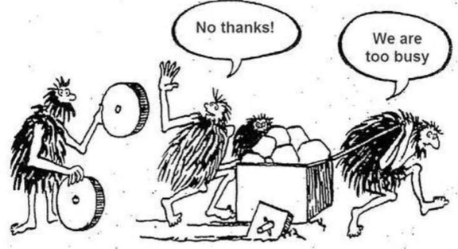
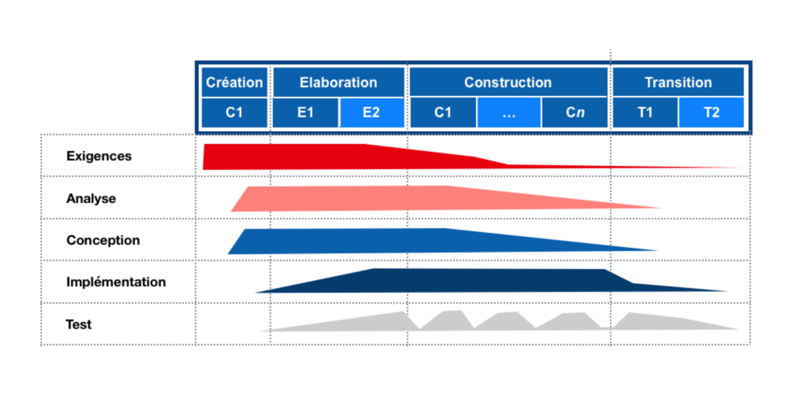
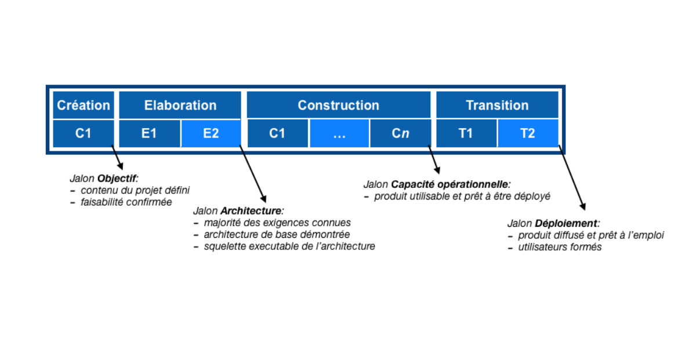
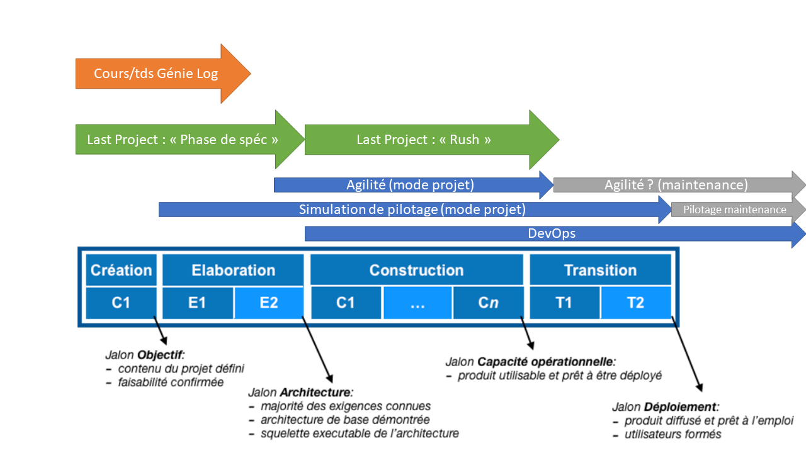
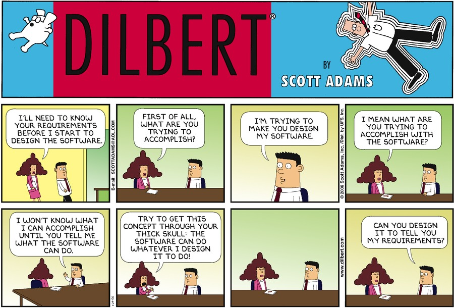
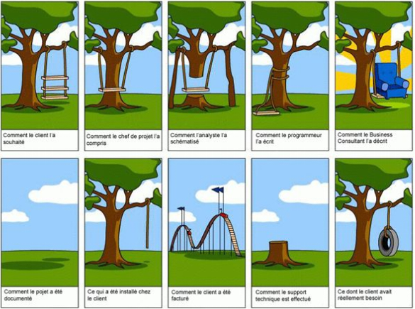
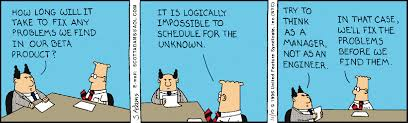
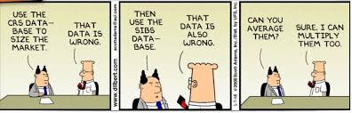
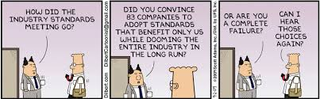

# Au départ...

# Plan

1. Positionnement et objectifs des cours/tds de génie logiciel
2. Pourquoi développer des logiciels
3. Définition du génie logiciel
4. Mythes
5. Qualité

# Objectifs

## Objectifs généraux

1. Culture générale projet logiciel
2. 2 drôles de termes : _Création_ et _Élaboration_

### Hors périmètre de ce cours

- Le **COMMENT**. On se concentre sur le **POURQUOI** et le **QUOI**
  - par ex : diagramme de classes et conception
- Gestion de projet, Work Breakdown Structure (WBS) que vous verrez en INFO3 (cours _simulation de pilotage_)
- DevOps (en INFO2 aussi)

### Indirectement lié

- Agilité : on fera une matinée avec Yifan pour faire le lien.
  - orga & réalisation. important pour parler de priorisation et de roadmap

### Comment obtenir les besoins **réels**

**point d'attention systématique** : on va devoir travailler l'écoute et l'empathie parce que le client est compétent dans son domaine mais pas en GL !!

- il faudra **lire entre les lignes**
- apprendre à **poser des questions** ! même voire surtout des questions idiotes !!
- **reformuler** souvent pour s'assurer d'une bonne compréhension mutuelle
- chercher **plusieurs axes** "d'attaque" des besoins pour mettre le client en face de ses contradictions et mieux comprendre les **priorités**
- identifier et clarifier les **hypothèses** et les **contraintes**

# Comment décrire au mieux un logiciel à réaliser

- pour que les concepteurs aient tous les éléments en vue,
- et que le résultat corresponde au mieux aux réels besoins des clients et à leurs priorités
- en s'assurant que ça tient dans le budget, voire les délais ! donc en cadrant suffisamment le périmètre du projet

# Création ... Élaboration

:::::::::::::: {.columns}

::: {.column width="40%" }

1. Culture générale
1. Comprendre et s'approprier les phases de **création** et d'**élaboration**
1. Travailler et s'entraîner avec les outils, diagrammes, terminologies, checklists

\

> Synonymes pour _création_ : inception, cadrage, voire précadrage
> :::

::: {.column width="60%" }

source: https://fr.wikipedia.org/wiki/Processus_unifié
:::

::::::::::::::

# INFO2 ... INFO3

:::::::::::::: {.columns align=center totalwidth=8em}

::: {.column width="50%"}

:::

::: {.column width="50%"}

:::

::::::::::::::

# Objectifs

Ces cours et td de GL doivent vous aider à mieux structurer votre réflexion

Objectifs "techniques" :

- diagrammes d'acteurs, de cas d'utilisation, d'interaction générale
- glossaire
- acteurs (humain, non-humain) / partie prenantes
- objets du domaine
- cas d'utilisation
  - et cas limites, cas d'erreur des UC
  - hiérarchisation
  - essentiels / détaillés
- FQM
- IHM, architecture générale

# Nos rêves :-)

- A la fin de votre formation, vous serez en capacité d’intégrer comme ingénieur une équipe de développement.
- A la fin du module génie logiciel, vous serez capables de participer aux phases suivantes d’un développement : création, (inception, démarrage, cadrage qui vise à définir le produit et les objectifs du projet), élaboration (toutes les facettes de l'élaboration), tests, recette.
- Pour les interviews, vous pourrez mettre en application les savoir être principaux d'empathie, reformulation et pédagogie au cours d’une interview basée sur un projet concret; et appliquer les principes du QQOQCCP et de ses 7 questionnements.
- Qualité transverse : vous montrerez dans ces productions (dessins, listes, scénarios, descriptions) les qualités de précision et de concision. Et appliquerez le principe _DRY_ (Don’t Repeat Yourself), _"Dans un système, toute connaissance doit avoir une représentation unique, non-ambiguë, faisant autorité"_. Cela commencera avec la terminologie.

\

> Remarque: Nous définissons le “projet type” pour cet enseignement comme un projet d’une dizaine de mois homme (tout compris. soit 200 j.h).

::: notes

- A la fin du module génie logiciel, les étudiants seront capables de participer aux phases suivantes d’un développement: inception (démarrage. phase création ou de cadrage qui vise à définir le produit et les objectifs du projet), élaboration (les différentes phases), conception, architecture, conception interface homme machine, tests, déploiement, devops, review, recette.

> Remarque: Nous définissons le “projet type” pour cet enseignement comme un projet d’une dizaine de mois homme (tout compris. 200 j.h) et qui est fourni aux étudiants sous forme d’une expression de besoin d’une dizaine de pages.

- Inception : A la fin du module Inception, l’étudiant pourra exposer le rôle de la phase de démarrage et donner une liste de questions permettant de valider le choix d’un développement logiciel comme livrable d’un projet d’entreprise.
- Besoins (requirements) et Spécifications : A la fin du module les étudiants pourront montrer qu’il font la différence entre un besoin et une spécification.

- Interviews : pourra montrer l'application les savoir être principaux de courtoisie, de reformulation et de pédagogie au cours d’une interview basée sur un projet concret de plusieurs mois hommes.
- Interviews : pourra appliquer les principes du QQOQCCP et de ses 7 questionnements.
- Interviews : montrera sa capacité à faire des reformulations, en proposant plusieurs interprétations de phrases ambiguës
- Élaboration: pourra lister et nommer les acteurs d’un projet présenté sous forme d’une demande de quelques pages sans oublis et sans hors sujets.
- Acteurs 1: identifiera dans une description de projet l’acteur principal, les acteurs indirects, les acteurs secondaires et pourra expliquer ces choix.
- Acteurs 2: pourra organiser la liste des acteurs d’un projet en hiérarchie pour optimiser la conception des Cas d’utilisation et le développement du logiciel.

- Élaboration: pourra lister et nommer les cas d’utilisation d’un projet présenté sous forme d’une demande de quelques pages,en les classant par ordre décroissant d’importance, sans oubli (en particulier les dépendances de données), sans hors sujets.
- UC 1: pourra expliciter l’importance d’un UC en montrant le lien de l’objectif de l’acteur principal du cas d’utilisation et les besoins / spécifications initiales.
- Élaboration: pourra écrire un cas d’utilisation principal en indiquant clairement les objectifs de l’acteur et fournir un scénario démontrant la faisabilité du logiciel.
- Élaboration: montrera au cours d’une élaboration sa capacité à identifier les fonctions importantes du système et décrire celles-ci dans un tableau FQM.
- Élaboration: démontrera sa capacité à nommer les différents éléments d’une élaboration avec des noms pertinents.

- Cycle de vie: pourra expliquer l’utilité des différentes phases d’un projet.
- Cycle de vie: pourra nommer explicitement (QCM) les différentes phases d’un projet et la terminologie pour les décrire.
- Cycle de vie: montrera par une planification d’un projet présenté sous forme d’une demande de quelques pages sa maîtrise du cycle de vie (pas d’oubli et pas de d’erreur factuelles sur la durée et l’effort des différentes phases..
- Diagramme des acteurs: sera capable de présenter les acteurs et leur liens d'héritage pour un projet type.
- Diagramme d'interaction général: sera capable de dessiner un diagramme d’interaction général d’un projet type
- Diagramme des cas d'utilisation: sera capable de dessiner Le diagramme des cas d'utilisation sans oublier la frontière et en mettant en avant les liens d’extension et d’utilisation entre cas d’utilisation.

- Extension & Usage : sera capable d’expliquer la différence entre les liens extension et usage entre les cas d’utilisation.
- UC 2: sera capable d’écrire un cas d’utilisation important d’un projet type de tel façon que l’on soit convaincu de la faisabilité du cas d’utilisation (i.e. le scénario principal est crédible).
- UC 3: sera capable d’écrire un cas d’utilisation important d’un projet type de tel façon que l’on soit convaincu que l’ensemble des cas alternatifs sont traités.

- Glossaire 1 : sera capable d’écrire un glossaire d’un projet type en utilisant les deux formes d’écriture intention et extension.
- Glossaire 3: sera capable d’écrire un glossaire d’un projet type, qui permet la réduction de la complexité d’écriture des cas d’utilisation.
- MOD: sera capable de dessiner un MOD cohérent, sans acteurs, donnant une vue d’ensemble du projet.
- Transverse DRY : montrera dans ces productions (dessins, listes, scénarios, descriptions) les qualités de fermeté et de concision qui font les bonnes conceptions (Don’t repeat Yourself).

:::

# Pourquoi développons nous des logiciels

1. Pour le Plaisir
1. Pour gagner sa vie
1. Pour répondre à des **besoins** ! Et régler des **problèmes**

::: notes
ça semble évident ou inutile mais de nombreux échecs se cachent derrière le non respect de ce principe

- overdesign
- passer à côté des vraies priorités
- mauvaises compréhension, donc résultat inadéquat/frustrant/rejeté/inutile ... jeté !
  :::

# Pour répondre à des besoins !

1. Faire fonctionner des appareils
1. Fournir des services aux utilisateurs
   1. Services de Communication
   1. Services variés
1. Réaliser des Tâches
   1. Travailler
   1. Culture détente etc

::: notes

- automate CB, imprimante, pistolet détecteur de plomb, ...
- Skype, Discord, Word, ...
- générer des factures, conversion de format, retouche auto de photos, catégorisation de "trucs" (textes, photos, pixels d'un échantillon, ...)
- VLC, netflix, ...
  :::

---

# Deux Grands cas de figure

1. Le fonctionnement de machines électroniques
   1. Les systèmes d'exploitation sont historiquement les premiers logiciels importants
   1. Mais aujourd'hui le nombre d'appareils pilotés par des logiciels est colossal
1. permettre à une personne de réaliser une tâche de manipulation de données
   1. En Général c'est une activité liée au travail
   2. les jeux ...

# Génie logiciel

1. Le Génie logiciel que nous allons voir ensemble est plus orienté vers la deuxième mission
   1. En effet, nous allons nous intéresser à **l'aspect humain de la compréhension d'un objectif de développement.**
   1. ex: pilote automatique => spécifications peuvent être écrites.
1. Cette mission est double
   1. Comprendre et formaliser les besoins et proposer une solution qui les satisfasse
   1. Développer la solution
1. Ainsi nous avons une partie plus science humaine puis une partie plus technique mais elles doivent être judicieusement associées
   1. Compréhension humaine sans les aspects techniques => risque d'être _hors sol_
   1. Expertise technique sans compréhension profonde des besoins => risque de faire des jolis ~~logiciels~~ bibelots inutiles

::: notes

pendant ce cours, on ne s'intéressera pas en détail au développement ... mais cela n'empêche pas 1/ de penser aux contraintes techniques, 2/ de se projeter de manière macro sur les questions d'architecture pour être réaliste, 3/ de se projeter de manière macro sur les questions d'IHM pour faire des UC adaptés

:::

# Historiquement

**La plupart des projets informatiques se passent mal !**

- dépassement important des **délais**
- dépassement important des **coûts**
- non **conformité** :
  - bugs,
  - limitations,
  - "flou" car comportement attendu "discutable" (imprécision, quiproquo, ...)
- difficulté et coût important de de maintenance

# Et qualité souvent insuffisante

:::::::::::::: {.columns align=center totalwidth=8em}

::: {.column width="70%"}

la qualité concerne bien sûr toute la chaîne :

- expression de besoins
  - cahier des charges fonctionnel
  - préparation des cas tests
  - organisation des recettes,
  - …
- qualité et l'implication des participants !!!
- qualité et efficacité des organisations
- Qualité du développement logiciel : conception, développement, cycle de vie du logiciel

:::

::: {.column width="30%"}

Manque de :

- Précision
- Stabilité
- Complétude

:::

::::::::::::::

# Depuis quand ?

- crise du logiciel en 1968.
  - baisse significative de la qualité des logiciels
    - puissance de calcul des ordinateurs en hausse
    - complexité des logiciels en hausse
  - Retards, dépassement de coût,
    - baisse de la fiabilité,
    - baisse des performances
- Coût important de maintenance
- coût du matériel informatique en baisse // coût du logiciel en hausse
  - études sur les méthodes de travail adaptées à la complexité des logiciels contemporains => **génie logiciel**
- l'utilisation des méthodes de génie logiciel se répand _doucement_ dans l'industrie du logiciel. **A VOUS DE JOUER :-)**

# Vie d'un logiciel

- POURQUOI: Besoins / Problèmes / Exigences
  - ~~_Peuvent être flous, imprécis, irréalistes, incomplets_~~, _et changer ! Maturité, évolution marché, contexte entreprise, contexte réglementaire, réorganisation, …_
- QUOI: Cahier des charges fonctionnel
- COMMENT : Architecture
- COMMENT : Conception, Spécifications techniques
- Dev + tests unitaires, + tests d'intégration
- Maintenance corrective / évolutive
- Réutilisation / évolutions majeures / refonte

# Classique mais tellement vrai !

{ width=350px }

# Définition du Génie Logiciel

1. L'objectif du génie logiciel est d'assurer la qualité logicielle et d'industrialiser la production
1. Le génie logiciel s'applique à des systèmes de toute taille, et à toutes les phases du cycle de vie d'un logiciel.
1. Le Génie Logiciel est la discipline qui se préoccupe de l'application de principes, de pratiques et de connaissances à la construction efficace et effective de systèmes logiciels qui satisfont aux exigences des clients et des utilisateurs.

# Cycle de Vie et Outils

1. Le génie logiciel utilise des techniques d'ingénierie : méthodes, processus, techniques et mesures. Le génie logiciel peut s'appuyer sur l'utilisation d'outils qui gèrent le processus de conception et développement, analysent et modèlent des artefacts logiciels ; montrent et contrôlent la qualité; assurent que l'approche de l'évolution et de la réutilisation est disciplinée et contrôlée.
1. Ce cycle de vie comprend analyse des exigences et écriture des spécifications, conception (design), construction, tests et recette, installation, mise en œuvre, et maintenance.
1. Attention trop de processus tue le processus.

# Boite à outils

1. L'écriture de logiciel qui peut impliquer soit un unique développeur soit une équipe, nécessite que l'on choisisse les outils, les méthodes, et les approches les plus adaptés et applicables à l'environnement de développement visé.
1. La « boite à out' » du génie logiciel s'améliore et s'étend, les contrats, les patrons de conceptions, en font partie et sont considérés comme des bonnes pratiques.

# Outils et contexte

1. Les apports du génie logiciel sont précieux pour le développement d'un logiciel dans n'importe quel domaine d'application où l'on se soucie de professionnalisme, qualité, coût, délais.
1. En résumé, quelque soit le contexte il est nécessaire de réfléchir aux outils que l'on doit mettre en œuvre. Ces choix, d'ordre organisationnel et technique, impactent sur la taille de l'effort nécessaire à produire le logiciel.

\

> Pour ces cours et tds ... pas d'outils autre que le cerveau et le crayon (ou Plantuml).

# Deux Grandes Cultures

## Développement Discipliné

1. des Contrats
   - engagement des deux parties
1. des Documents
   - permettant de définir les objectifs et la recette
1. des Métriques
   - pour ne pas avoir d'ambiguïté et pouvoir utiliser des arguments rationnels
1. un Langage
   - communs aux deux parties
1. une Stratégie de décomposition

---

## Développement Agile

1. un Client
   - Présent en continue qui pilote les évolutions
1. une Équipe
   - responsable et engagée
1. une Relation de confiance entre les parties
1. une Stratégie de décomposition

# Ingénieur Logiciel ?

## Ce qui distingue des autres ingénieurs

1. Une science à part : Modification Mineure -> Défaut Majeur

   1. Des grandeurs discrètes au lieu de grandeurs continues
   1. Phase de MEP et production particulières
   1. Une malléabilité traîtresse
   1. Un delta de productivité colossal entre différents programmeurs

1. Des ethnies différentes pour la qualité
   1. Le debuggage continue MS
   1. Tout doit être prouvé : Spécifications Mathématiques
   1. la qualité c'est d'abord l'architecture : Unix
   1. Code and Test
   1. Test and Code (TDD)

---

## Ce qui distingue II

1. l’absence de récurrence
   1. Chaque projet est une découverte
   1. Iceberg de complexité
   1. l'innovation est une nécessité
1. La maintenance
   1. Les logiciels ont une maintenance complexe
   1. Il n'y pas de garagistes, que des "ingénieurs"

::: notes

même dans la _vraie vie_, 3000 sortes de projet différents !

:::

---

## Ce qui rapproche

1. Qualité
   1. Comme dans toutes les activités d’ingénierie c'est la qualité du produit fabriqué qui en fait sa valeur.
1. Engagement
1. Gestion du risque
1. Technicité

# Nos questions ?

## Quoi/Quand/Comment

1. Les trois questions auxquelles nous devons répondre
1. Faire **quoi** dans quel **ordre** avec quelles **techniques** et quels **outils** ?
1. Comment contrôler et piloter le processus ?
1. Comment faire mieux ?
   1. Efficacité
   1. gestion des Risques

## QQOQCCP

« Qui ? Quoi ? Où ? Quand ? Comment ? Combien ? Pourquoi ? »

Une méthode de questionnement parmi d'autres. L'essentiel est de se poser toutes les questions, et plusieurs fois !

# Mythes du génie logiciel

## Mythes de Management

1. Les managers s’accrochent à des mythes. Comme une personne à une paille pour se sauver de la noyade.
1. Mythe : Le livre des Standards
   1. "Nous avons un livre avec tous les standards de la profession". Cela ne donne t-il pas à tous nos professionnels tout ce qu'ils ont à savoir ?
   1. Il existe (en fait plusieurs) ! mais est-il utilisé ?
   1. Le personnel est-il au courant de son existence ?
   1. Ce guide est-il à jour ?
   1. Est-il complet ?
   1. Réponses: Non pour toutes ! (et ils sont parfois indigestes...)

---

## Mythes du Management II

1. Mythe: ordinateurs dernier cri
   1. Mythe : Mon personnel a ce qu'il faut, j'ai acheté les ordinateurs dernier cri.
   1. Ce n'est pas l'ordinateur qui fait le logiciel.
   1. Il faut mieux de bon logiciel de gestion et développement de projets logiciels que des ordinateurs puissants
   1. La plupart des équipes de développement sous-utilisent les logiciels d'aide au développement.
1. Mythe: Ajouter des Hommes
   1. Mythe : Si l'on est en retard sur le développement alors ajoutons du personnel
   1. Réalité : Ajouter des personnes à un projet en retard le rend encore plus en retard (Brooks 75).
   1. En effet les nouveaux doivent être formés par les anciens ...

::: notes

Last Project : on n'ajoute un membre à l'équipe que si on pense que le projet/le CP est suffisamment solide et/ou que ça peut lui servir. Jamais sur des projets qui semblent _en danger_.

:::

---

## Mythes Clients

1. Les clients ne sont pas informés des difficultés de l'écriture de logiciels. Ils ont des attentes irréalistes du point de vue des développeurs
1. Mythe: Exigences faibles
   1. Mythe : On peut commencer le processus de dev à partir de quelques phrases de description
   1. Réalité : Une mauvaise définition des exigences et des spécifications est la cause la plus importante de l’échec pour les projets logiciels.
   1. Les caractéristiques d'un logiciel ne peuvent être proprement déterminées qu'avec une communication approfondie entre le client et les développeurs.

::: notes

mode du MVP : bienfaits et danger. ex : un MVP d'un an potentiellement poubelle parce qu'il ne répond pas aux besoins (ex: M....an) !

:::

---

## Mythes Clients II

1. Mythe: Changement
   1. Mythe : Les exigences changent tout le temps mais ce n'est pas grave car le logiciel est un objet flexible.
   1. Réalité : le coût d'un changement **croit exponentiellement** avec la phase dans lequel il est introduit. Petite Modification => grosse catastrophe
   1. en phase de Définition : 1X
   1. en phase de Développement : 1,5 à 6X
   1. en phase de Maintenance : 60X à 100X
1. Mythes de la complexité
   1. Les clients ont une très très mauvaise appréciation de la complexité.
   1. exemple : Un DAB (distributeur automatique de billets) c'est simple !

---

## Mythes Développeurs

1. Mythes des Développeurs
   1. Longuement vu comme un art le passage à l'ingénierie se fait dans la douleur.
   1. La diffusion dans le grand public complique la donne.
1. Mythe : ça tourne => c'est fini
   1. Mythe : Une fois le code écrit notre travail est fini.
   1. Réalité : 50 à 80 % de l'effort sera fourni après la première livraison au client.

---

## Mythes Développeurs II

1. Mythe: La Qualité se mesure sur le code
   1. Mythe : On ne peut pas mesurer la qualité d'un code avant qu'il ne tourne.
   1. Réalité : Bien des Bugs/Erreurs/C...es peuvent être identifiés dans les étapes de spécifications, d'analyse et de conception.
   1. Certains défauts logiciels ne sont pas détectés par les tests mais par une lecture attentive du code (_Revue_ de code)

\

> _"Heureusement, nous, utilisateurs, ne devons pas découvrir tous les bugs du logiciel une fois livré ..."_

---

## Mythes Développeurs III

1. Mythe: l'exécutable est le livrable
   1. Mythe: le code est le seul livrable d'un projet réussi
   1. Réalité:
      - La documentation
      - Le plan de déploiement
      - Les données
      - Les configurations
      - La formation
      - voire la gestion du changement et la migration et l'organisation du _rollout_

---

:::::::::::::: {.columns}

::: {.column width="40%"}

## Développeur IV

1. Mythe : les bugs
1. Mark II : décembre 1947
1. Fils de Bugs
   :::

::: {.column width="60%"}

:::

::::::::::::::

# Qualité logicielle

## La qualité

1. L'industrie du logiciel est réputée pour la faible qualité de sa production
1. Dépassement des Délais
1. Dépassement des Coûts
1. Non conformité aux Exigences ou aux besoins
1. Un niveau de qualité des livrables suboptimals (présence d'erreurs appelées bugs)

---

---

## Définir la qualité

1. Comment définissez vous la qualité ?
   1. pour un sportif
   1. une œuvre d'art
   1. un produit manufacturé (toaster)
   1. café
1. un état d'esprit ?
1. Référence le cours de Gestion de projet
   1. Analyse de la Valeur

---

# Data Quality

---

## La Norme ISO 9126

1. La norme ISO 9126 propose une liste de Qualité pour définir la qualité logicielle
1. Capacité fonctionnelle : Est-ce que le logiciel répond aux besoins fonctionnels exprimés ?
1. Fiabilité : Est-ce que le logiciel maintient son niveau de service dans des conditions précises et pendant une période déterminée ?
1. Rendement / Efficacité : Est-ce que le logiciel requiert un dimensionnement rentable et proportionné de la plate-forme d’hébergement en regard des autres exigences ?
1. Maintenabilité : Est-ce que le logiciel requiert peu d’effort à son évolution par rapport aux nouveaux besoins ?
1. Portabilité : Est-ce que le logiciel peut être transféré d’une plate-forme ou d’un environnement à un autre ?

\

> https://fr.wikipedia.org/wiki/ISO/CEI_9126

---

## Capacité fonctionnelle

1. Est-ce que le logiciel répond aux besoins fonctionnels exprimés ?
1. Pertinence
1. Exactitude
1. Interopérabilité
1. Sécurité
1. Conformité

---

## Fiabilité

1. Est-ce que le logiciel maintient son niveau de service dans des conditions précises et pendant une période déterminée ?
1. Maturité
1. Tolérance aux pannes (voire _Chaos Engineering_ !)
1. Facilité de récupération
1. Conformité

---

## Rendement / Efficacité

1. Est-ce que le logiciel requiert un dimensionnement rentable et proportionné de la plate-forme d’hébergement en regard des autres exigences ?
1. Comportement temporel
1. Utilisation des ressources
1. Conformité

---

## Maintenabilité

1. Est-ce que le logiciel requiert peu d’effort à son évolution par rapport aux nouveaux besoins ?
1. Facilité d'analyse
1. Facilité de modification
1. Stabilité
1. Testabilité ... **vous avez entendu parler des TU et des TNR ?**
1. Conformité

---

## Portabilité

1. Est-ce que le logiciel peut être transféré d’une plate-forme ou d’un environnement à un autre ?
1. Facilité d'adaptation
1. Facilité d'installation
1. Coexistence
1. Interchangeabilité
1. Conformité

---

## Usage de cette norme

1. C'est bien d'avoir une norme ... c'est un des mythes du Génie logiciel ...
1. La norme permet d'avoir un référentiel
1. Quand faites vous le test de ce référentiel ?
1. Utile pour donner une direction
1. Quel est le coût de la qualité ?

---

# Le standard qui tue

