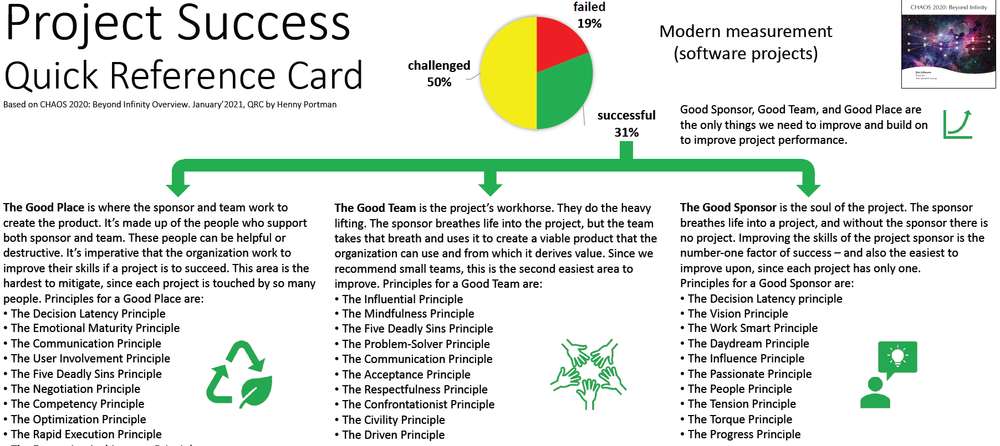
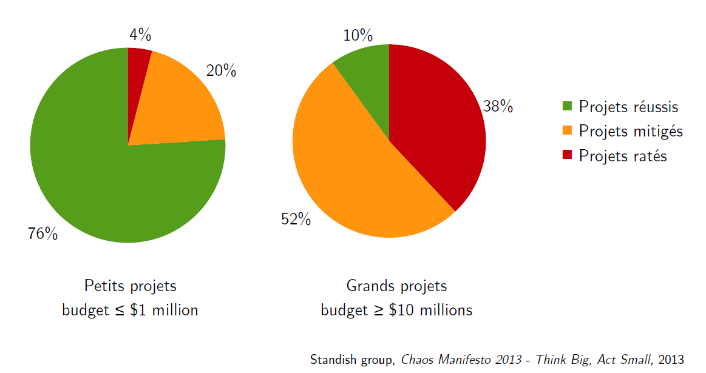
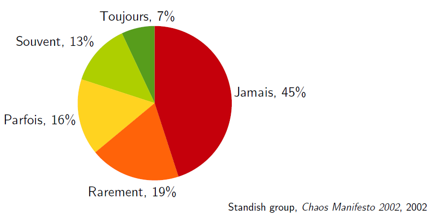

# Génie Logiciel : Enfonçons le clou !

Pourquoi le Génie Logiciel ? 

parce qu'il y a beaucoup d'échecs et de demi-échecs !

# Extraits (1) : Étude sur 8 380 projets 

**Standish Group, 1995**

- Succès : 16 %
- Problématique : 53 % (budget ou délais non respectés, défaut de
fonctionnalités)
- Échec : 31 % (abandonné)

# Extraits (2) : Standish, 2020

source: https://hennyportman.files.wordpress.com/2021/01/project-success-qrc-standish-group-chaos-report-2020.jpg

# Extraits (3) : Petits vs Gros projets

source: https://www.lri.fr/~longuet

# Extraits (4) : Utilisation ?

------------------------ 

*"La satisfaction du client et la valeur du produit sont plus grandes lorsque les fonctionnalités livrées sont bien moins nombreuses que demandé et ne remplissent que les besoins évidents" (Standish group, Chaos Report 2015)*

# Extraits (5) : Facilité de maintenance ?

**Zeltovitz, Tom De Marco (19??)**

|                             | Répartition effort dév. | Origine des erreurs  | Coût de la maintenance |
| :---                        | :---:                   | :---------------:    | :---:                  |
| **Définitions des besoins** | 6%                      | **56%**              | **82%**                |
| Conception                  | 5%                      | 27%                  | 13%                    |
| Codage                      | 7%                      | 7%                   | 1%                     |
| Intégration Tests           | 15%                     | 5%                   | 2%                     |
| **Maintenance**             | **67%**                 | 5%                   | 2%                     |

# En résumé

Constat du développement logiciel dès la fin des années 60 :

- délais de livraison non respectés
- budgets non respectés
- **ne répond pas aux besoins de l'utilisateur ou du client**
- difficile à utiliser, maintenir, et faire évoluer

# "Bon sens" et formalisme UML

- l'essentiel : 
	- comprendre les besoins, 
	- se comprendre à l'intérieur de l'équipe (expliciter sans ambiguité), 
	- se faire comprendre du client (reformuler)
- le formalisme UML, qui sert comme :
	- check list
	- moyen d'expression synthétique
	- moyen d'expression interne à l'équipe
	- moyen d'expression formel auprès du client; qui complète, illustre, synthétise un discours
	- outil indispensable d'homogénéité pour les gros projets ou les grandes organisations
	- Modélisation graphique : très utile ... seulement s'il est compris par tous de la même manière (merci UML)
	- Langage standard

> pour les INFO2 ? Les 2 sont importants, l'essentiel est essentiel, UML est un outil.

# Introduction à l'élaboration

**Comprendre les besoins du client pour rédiger le cahier des charges fonctionnel.**

La démarche générale est *simple* et peut s'exprimer en quelques questions :

* Quelles sont les limites du système à construire (Frontière / **Périmètre** / Scope)
* Quels sont les utilisateurs du système (**Acteurs**) et que cherchent-t-ils à faire (**cas d'usage/UC**) ?
* Quels sont les objets (du monde réel) et leur association dans le contexte du projet (**MOD**) ?
* Quels objets utilisés par chaque cas d'utilisation ?
* Comment gère t-on les problématique de qualité (**FQM**) ?
* Comment construire effectivement le système avec du code ? (architecture, études techniques, maquettes IHM, ...)

**Si une de ces questions est ignorée le risque d'un échec est fortement augmenté.**

----------------------------------

La compréhension du **contexte** du projet et la formalisation du **glossaire** sont des prérequis indispensables.

**L'ensemble de ces éléments doit être complété au fur et à mesure, et la cohérence de l'ensemble sans cesse remise en question.**

------------------

# Rêvons !

L’équipe a réfléchi aux objets du domaine manipulés

L’équipe a identifié et décrit tous les scénarios d’utilisation du système qu'elle est sur le point de construire, et aux acteurs concernés

L’équipe a vérifié que toutes les exigences fonctionnelles du système sont prises en compte dans l'analyse et qu'elles sont satisfaites.

L’équipe est capable de décrire le logiciel à l'aide de 4 schémas principaux : 

- un diagramme des acteurs qui liste les acteurs et leur relation,
- de manière synthétique au travers d'un diagramme d'interactions générale, 
- de manière détaillée avec un diagramme exhaustif des cas d'utilisations,
- de manière détaillée avec un diagramme des objets du domaine, de leurs relations et leurs attributs

# Processus - formalisme

Au-delà de ces étapes, un processus formel doit permettre de répondre à d'autres exigences communes à tout projet :

1. Il doit être suffisamment souple pour accueillir différents styles et types de problèmes.
2. Il doit soutenir la manière dont les gens travaillent vraiment (y compris le prototypage et développement itératif / incrémental).
3. Il doit servir de guide aux membres moins expérimentés de l’équipe, en les aidant à être aussi productifs que possible sans menotter davantage les membres expérimentés.

Exemple de définition d'un **Processus de développement logiciel** : *Ensemble d'activités successives, organisées en vue de la production d'un logiciel.*

En pratique :

- Pas de processus idéal
- Choix du processus en fonction des contraintes (taille des équipes, temps, qualité...)
- Adaptation de « processus types » aux besoins réels

# Première étape : construire le contexte

Le contexte d'un logiciel est l'ensemble des concepts manipulés par les utilisateurs et par le logiciel.

La construction du contexte est fortement liée à la première version du glossaire, au périmètre du projet, et implicitement à la liste des acteurs.

Exemple pour un Logiciel de gestion des réservations d'un spectacle. Les concepts à clarifier : billets, horaire, spectateur, spectacle, réservation, paiement, place, confort, prix, remboursement, balcon, poulailler, cintres, VIP, etc.
 
Construire le contexte = cela permet de parler la même langue que les experts ou utilisateurs du domaine :

- expert : spécialiste du domaine *métier*
- utilisateur : quand il n'y a pas d'expert, les utilisateurs et leurs besoins est ce qui s'en rapproche le plus.

> et donc de se rendre compte VITE quand on n'a pas compris. Le fameux **"contexte et enjeux"** reste d'actualité !

------------------

> Bien entendu, si vos experts ne sont pas bons (ou juste pas assez matures sur le sujet) ... il faut donc toujours avoir un panel d'utilisateurs pour valider les cas d'utilisation.

Pour construire le contexte, le premier outil est le vocabulaire (glossaire) du logiciel à réaliser.

Le logiciel à réaliser, le système visé : l'usage est de l'appeler  **le système**.

------------------

!include 4-2-intro-glossaire.md

------------------

!include 4-3-intro-acteurs.md

------------------

!include 4-4-intro-usecase.md

------------------

!include 4-5-retours-td3.md
