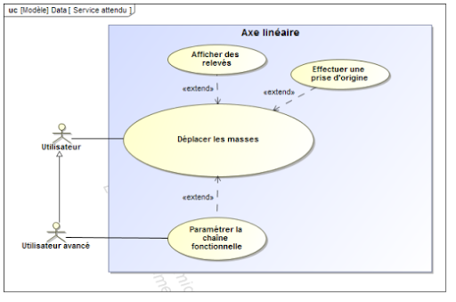
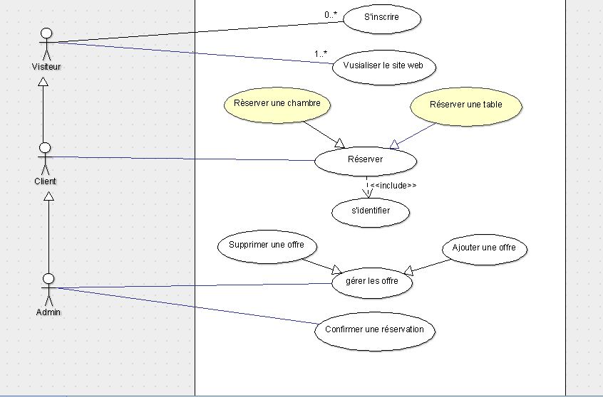
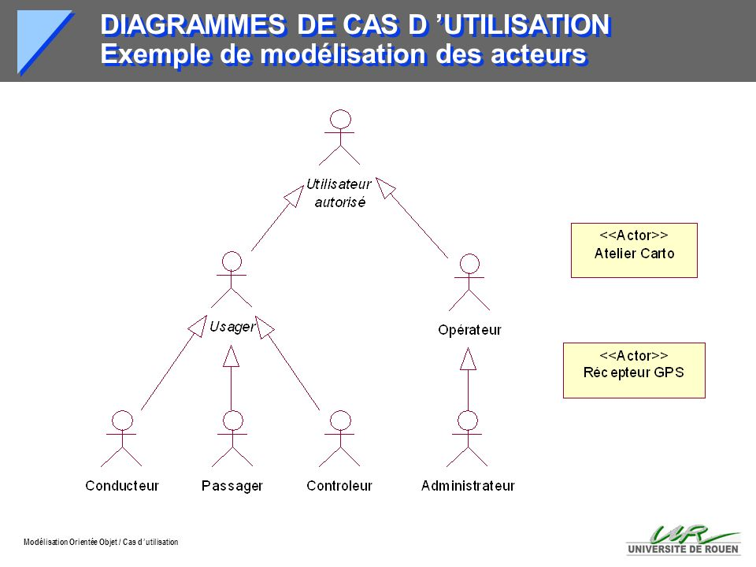
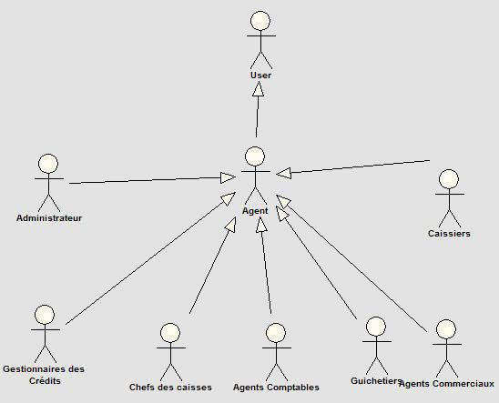

# Acteurs 

Comment modéliser les personnes qui interagissent avec le logiciel ?

Doit on modéliser seulement les personnes qui touchent l'ordinateur (les interfaces physiques) ?

Qui est "impacté" par le logiciel ?

Quelles sont les interfaces du logiciel (système) avec l'extérieur ?

Doit-on modéliser autre chose que des utilisateurs ? 

-------------------

## A la recherche des Acteurs 

### Définition 

Les acteurs d'un système sont les entités externes à ce système qui interagissent (saisie de données, réception d'information, ...) avec lui. Les acteurs sont donc à l'extérieur du système et dialoguent avec lui. Ces acteurs permettent de cerner l'interface que le système va devoir offrir à son environnement. 

Oublier des acteurs ou en identifier de faux conduit donc nécessairement à se tromper sur l'interface et donc la définition du système à produire.

### Acteurs Humains et les autres (Non Humains)

les acteurs incluent les utilisateurs humains, mais aussi les autres systèmes informatiques ou hardware qui vont communiquer avec le système.

-------------------

## Le Rôle 

Un utilisateur (qui n'est pas un acteur) peut avoir plusieurs rôles pour le système : il donne des information et il reçoit des informations ou déclenche des opérations dans le système ou sur d'autres acteurs. 

La bonne modélisation est celle qui identifie les différents rôles et donc permet de cibler directement le besoin en se limitant à chaque rôle l'un après l'aute sans avoir une solution générique pour tous qui n'est pas toujours appropriée.

Ainsi, plusieurs utilisateurs peuvent avoir le même rôle, et donc correspondre à un même acteur, et une même personne physique peut jouer des rôles différents vis-à-vis du système, et donc correspondre à plusieurs acteurs.

Chaque acteur doit être nommé. Ce nom doit refléter son rôle, car un acteur représente un rôle joué vis-à-vis du système.

**A RETENIR** : pour nous, ACTEUR = ROLE.

-------------------

Pour trouver les acteurs d'un système, il faut identifier quels sont les différents rôles que vont devoir jouer ses utilisateurs (ex. : responsable clientèle, responsable d'agence, administrateur, approbateur, ...). Il faut également s'intéresser aux autres systèmes avec lesquels le système va devoir communiquer,  comme :

- les périphériques manipulés par le système (imprimantes, hardware d'un distributeur de billets…) ;
- des systèmes informatiques externes au système, mais qui interagissent avec lui, etc.

-------------------

## Frontière 

Pour faciliter la recherche des acteurs, on peut imaginer les frontières du système. Tout ce qui est à l'extérieur et qui interagit avec le système est un acteur, tout ce qui est à l'intérieur est une fonctionnalité à réaliser.

\
Attention à la frontière : ceci doit être un point de discussion important avec le client en effet vous allez dimensionner le projet avec le choix de la frontière.
\

Exemple, une caisse de supermarché :

- Frontière 1: lecteur de carte, caissier, caisse (contient l'argent), lecteur de code à barre etc ...
- Frontière 2: les clients, les fournisseurs (le caissier est un élément du système).

-------------------

## Acteurs indirects 

j'ai trouvé ce conseil sur internet :

*"Vérifiez que les acteurs communiquent bien directement avec le système par émission ou réception de messages. Une erreur fréquente consiste à répertorier en tant qu'acteur des entités externes qui n'interagissent pas directement avec le système, mais uniquement par le biais d'un des véritables acteurs. Par exemple, l'hôtesse de caisse d'un magasin de grande distribution est un acteur pour la caisse enregistreuse, par contre, les clients du magasin ne correspondent pas à un acteur, car ils n'interagissent pas directement avec la caisse."*

\

Attention effectivement mais l'erreur peut aussi avoir lieu dans la non prise en compte de cet acteur indirect : le client d'une banque, il n'interagit pas avec le logiciel de gestion mais s'il ne peut obtenir la simulation qu'il souhaite il va changer de banque.
\ 

Il faut que les besoins des acteurs indirects de réaliser des tâches soient satisfaits sinon le logiciel sera défectueux.

\

Mais formellement ce n'est pas des acteurs au sens de la méthode mais des parties prenantes. Les modéliser comme acteurs indirects est une bonne chose.

-------------------

## Qu'implique l'existence d'un acteur ? 

Une interface API pour un acteur non-humain.

Une interface IHM (ou matériel) pour un acteur humain. 

La conception d'une interface est une des missions des développeurs/concepteurs.

Le critère de qualité d'une interface est quelle est adaptée aux **capacités de l'acteur**, ce qui implique que votre définition d'acteurs doit contenir le "niveau" de compétence de l'acteur, et s'il n'est pas homogène, il faudra en tenir compte.

Pour les acteurs humains, le niveau de compétence permet de définir le niveau d'ergonomie et la formation (et documentation) nécessaire pour les futurs utilisateurs ayant ce rôle.

Enfin une interface doit s'adapter au niveau de répétition des actions à faire. 

Quand les cas d'utilisation sont peu fréquents, l'interface doit être formative, (autoformation en interagissant).

Quand le cas d'utilisation implique de réaliser un même traitement sur plusieurs centaines de données, il faut que l'interface se fasse la plus économique possible.

Votre bon sens doit s'appliquer ici. Et une bonne donnée est la fréquence/densité d'utilisation.

-------------------

## Héritage 

Pour simplifier l'écriture des acteurs il est parfois judicieux d'utiliser un héritage simple : 

- A est un B signifie que A peut prendre la place d'un B devant l'ordinateur. 
- L'exemple typique est l'administrateur qui hérite en général d'autres rôles ... ou du directeur commercial qui est aussi un commercial, ou du responsable de formation qui est aussi un enseignant (?), ...

\

> Vous pourrez illustrer les relations d'héritage entre les acteurs dans les **diagramme de cas d'utilisation**. Parfois, afin d'alléger les schémas, on s'autorise à faire un *diagramme des acteurs* (pas UML), qui représente les relations d'héritage mais sans les détails des Use Cases.

-------------------

## Acteurs Principaux vs Acteurs Secondaires

**Attention** : 2 axes de définition

1. au niveau du système : 
- Les acteurs principaux : les acteurs qui utilisent les fonctions principales du système. Normalement les acteurs principaux sont à la gauche dans le cadre du diagramme de contexte.
	- Le système est construit pour répondre aux besoins / problèmes des acteurs principaux.
- Les acteurs secondaires : par exemple, les acteurs qui effectuent les tâches de maintenance, administration et paramétrage du système. 
	- Attention : il peut y avoir des use Case destinés à des Acteurs secondaires mais qui sont indispensables à la réussite du projet.
- Une façon de les identifier et de se poser la question : "le système existe-t-il sans eux ?"

2. au niveau des UC (*ce sera notre axe !*)
- L'acteur est dit principal pour un cas d'utilisation lorsque l'acteur est à l'initiative des échanges nécessaires pour réaliser le cas d'utilisation.
- Les acteurs secondaires sont sollicités par le système alors que le plus souvent, les acteurs principaux ont l'initiative des interactions

-------------------

### Pourquoi les acteurs ?

IL est important de bien décrire le rôle de l'acteur.

En effet on distribue l'écriture des cas d'utilisation sur l'équipe de développement.

IL faut que le document de description de l'acteur permette de synchroniser l'équipe de dev et d'orienter l'écriture des cas d'utilisation.

Mettre en avant les objectifs d'utilisation du système est une bonne idée.

Explicitez les difficultés que peut avoir l'acteur à utiliser le système :

- trop de répétition dans un temps court
- complexité de la procédure  
- problème de lisibilité (mont Saint Odile, 030 Meters == 0,30 Feet/second ?)

-------------------

### Parties prenantes (StakeHolders)

Souvent les parties prenantes ne sont pas définies !

**Il s'agit formellement de toutes les personnes impliquées de près ou de loin.**

\

Une définition : 

- Utilisateurs: Ceux qui utilisent le logiciel.
- Clients:  Ceux qui paient pour le logiciel.
- Développeurs:  Ceux qui conçoivent et construisent le logiciel.
- Managers: Ceux qui gèrent (manage) l’organisation développant le logiciel.

-------------------

Une autre : "Il s'agit de l'ensemble des personnes et des organisations qui ont quelque chose à voir avec le projet. Soit elles sont directement impliquées dans la conduite des opérations, soit elles sont impactées par la problématique de départ, par le choix ou la mise en œuvre des solutions. Certaines encore peuvent exercer une influence à différents niveaux."

\

- Le commanditaire (ou demandeur, ou encore client interne ) : c'est le premier concerné par le projet
- Les utilisateurs, les services impactés : ceux qui sont concernés directement par les livrables
- La direction : représente le pouvoir décisionnel et de contrôle ultime
- L'équipe projet : comprenant le chef de projet ainsi que les autres membres de l'équipe
- Les services supports impliqués : la comptabilité, la logistique, les ressources humaines, l'informatique...
- Les autres experts : apportant leurs conseils ponctuellement (directeurs fonctionnels...)
- Les clients : les premiers concernés en externe, impactés directement si leur rôle s'inscrit dans l'utilisation du produit ou service livré par le projet
- Les fournisseurs : de matière, de prestation, de main d' œuvre
- Les organismes publics  : dans le cas où votre projet doit s'inscrire dans un cadre juridique précis

-------------------

### Pourquoi on s'intéresse aux parties prenantes

- parce que les acteurs sont dedans
- parce que les acteurs oubliés sont dedans
- parce que les acteurs indirects sont dedans
- parce qu'au travers de leur objectifs, des enjeux essentiels du projet peuvent être identifiés

\

**On parlera abusivement de *Partie Prenante* alors qu'on pensera aux *Autres parties Prenantes*, hors acteurs.**

\

Ex: Les acteurs indirects sont des parties prenantes qui interagissent avec le système par l'intermédiaire d'un autre acteur.

# Diagramme des acteurs

Contient les liens d'héritages entre acteurs

Acteur matérialisé par Bonhomme en bâton

Les non-humains ont un chapeau

----------------------------------

En général lié aux UC

----------------------------------

Ça peut devenir compliqué 

----------------------------------

----------------------------------

# Synthèse

- Un Acteur = un rôle
- Acteur du système : à ne pas confondre avec les acteurs du projet de construction du système
- Bien différencier Acteurs Humains vs Acteurs Non Humains
- Bien différencier Acteurs (implicitement Directs) vs Acteurs Indirects
- Choix GL INFO2 : différencier Acteurs Indirects et Parties prenantes. Les Acteurs Indirects seront liés à des Use Cases et auront des Objectifs par rapport au système. Les Parties prenantes sont concernées / impactées mais le lien peut être plus global.
- Parties Prenantes = implicitement les *Autres* Parties Prenantes
- Un utilisateur (humain) peut avoir plusieurs rôles
