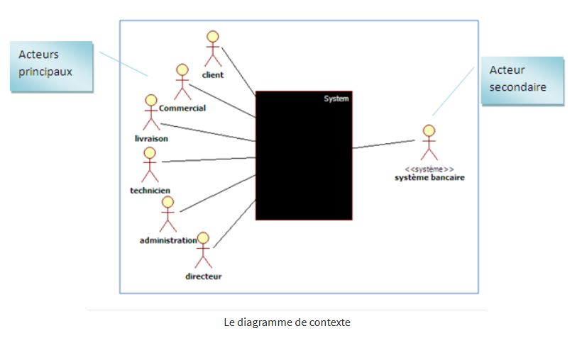
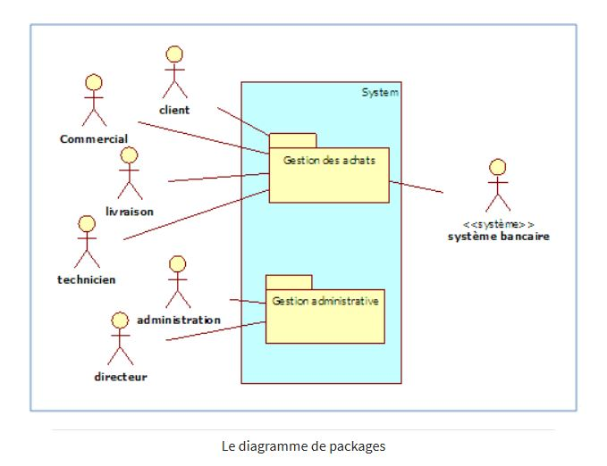
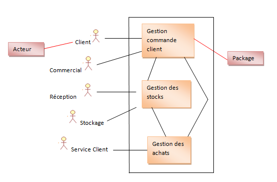

# Cas d'usage / Cas d'utilisation (Use Case)

Les objectifs des Acteurs.

L'outil le plus puissant et le plus difficile à utiliser dans la méthode Objectory est le cas d'usage.

-------------------

### User Story

- Format : En tant que <rôle> je veux <quoi> afin de <pourquoi>
- Les user stories sont indépendantes les une des autres
- User Story vs Use Case : 
    - Les Users stories sont plus simples à comprendre que les Use Cases.
    - niveau de détail faible dans les US. élevé dans les UC
    - suivant le contexte, on peut utiliser des US, ou des UC, ou d'abord des US puis des UC

-------------------

### Use Case

Un Use Case (ou cas d’utilisation) correspond à une liste d’étapes, définissant les interactions entre un acteur et le système, c’est-à-dire toutes les fonctionnalités que doit fournir le système.

Il peut être représenté sous 2 formes : la description textuelle et le diagramme.

Le template textuel n’est pas universel et dépend du style du concepteur, mais en règle générale, il se compose des éléments suivants : le nom, l’objectif, l’acteur principal, les acteurs secondaires, les pré-conditions nécessaires au déclenchement de l’action, la description de la séquence nominale, des éventuelles séquences alternatives, des séquences d’exceptions et des post-conditions.

-------------------

### Fonctionnalité

Les fonctionnalités se situent au niveau au dessus : par exemple "gérer les utilisateurs". Une fonctionnalité va se découper en plusieurs US/UC.

-------------------

**Question : pourquoi plutôt des US que des UC dans un contexte Agile ?**

# Identifier les objectifs

Un cas d'utilisation permet à un acteur de réaliser un objectif en interagissant avec le système. 

**La première étape est donc de recenser les objectif de chaque acteur !!**

# Diagramme d'interaction général 

Sur ce sujet, peu de consensus ! Et la difficulté réside aussi dans le type d'utilisation des diagrammes (de macro à micro, de fonctionnel à technique).

Pour ce cours, on va faire des diagrammes à cheval entre le diagramme de contexte et le diagramme de package.

Les principes sont très simples : 

- une boîte représente le système
- les acteurs sont à l'extérieur
- à l'intérieur du système, on va faire apparaître (graphiquement sous forme de package ou pas !) les grandes fonctionnalités que le système doit fournir.
- et les liens permettront de visualiser quels acteurs utiliseront quelles fonctionnalités
- détailler les fonctionnalités suffisamment pour donner beaucoup d’informations ... mais pas trop pour rester lisible

-------------------

:::::::::::::: {.columns}

::: {.column width="50%" }

:::

::: {.column width="50%" }

:::

::::::::::::::

-------------------

