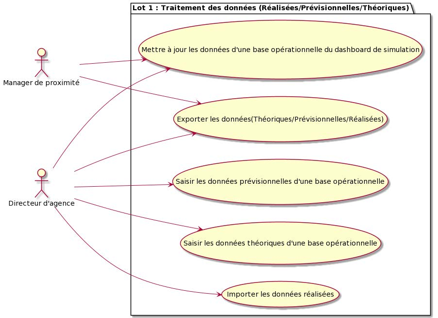
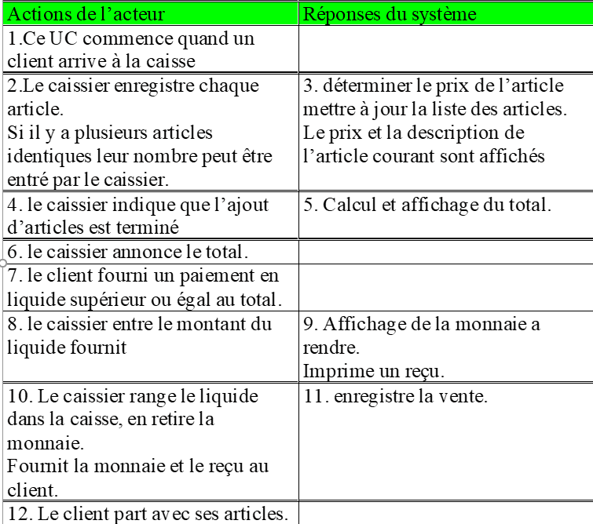

# Cas d'Utilisation (use Case / UC / CU)

Un cas d'utilisation est un document **narratif** qui décrit la **séquence** d'événements qui permet à un **acteur** de compléter un **objectif** en utilisant le **système**.

--------------------------------------------

## Les cas d'utilisation (ou cas d'usage)
1) Le cas d'utilisation est un processus métier.
1) Le processus une fois démarré doit atteindre sa conclusion et apporter une plus value à l'entreprise.
1) Un UC est une description de bout en bout d'un processus assez large qui contient un certain nombre de transactions et d'étapes.

## Le cas d'utilisation est défini par :
1) le système est considéré comme une boite noire.
1) les acteurs sont des receveurs ou producteurs de messages.
1) le contexte de fonctionnement du UC (les situations significatives). Prérequis/Pré-conditions. Post-Condition.
1) les événements ou signaux pertinents qui en fonctions du contexte déclenchent des actions
1) les actions du système en réponse à ces événements

--------------------------------------------

## Le cas d'utilisation : template 

- **Cas d'utilisation** : `<UC ID>` :  `<UC name>`
- **Description** : ...
	- Une ou deux phrases pour présenter brièvement le UC, incluant l'objectif pour l'acteur principal du UC.
	- N'oubliez pas de mentionner les concepts manipulés.  
- **Niveau** : Haut niveau ou détail ?  
- **Déclencheur** : Décrire l’événement qui initie ce UC
- **Acteur Primaire**: et son objectif pour ce UC
- **Acteurs secondaires**: et leur objectif éventuel pour ce UC
- **Parties Prenantes concernées**
- **Scenario Nominal** : tout se passe bien, c'est le scénario parfait !
	- c'est là que vous allez racontez l'histoire des interactions entre le système et les acteurs

------------------------------

- **Pre-conditions** : Listez les conditions nécessaires pour que ce cas d'utilisation puisse avoir lieu
- **Extensions** / **Scénarii alternatifs** : "Document alternate flows and exceptions to the main success scenario. Extensions are branches from the main scenario, and numbering should align with the step of the success scenario where the branch occurs." 
	- Indiquez dans quel point du scénario nominal le chemin alternatif démarre et où il reprend.
- **Post-Conditions**
	- Conditions de succès : "Describe the end condition of the Use Case where the Primary Actor’s goal is satisfied"
	- Minimal Guarantees : "Describe the guarantee or assurance that this Use Case provides to all Actors and Stakeholders to protect their interest regardless of whether the Use Case ends with success or failure."
	- Condition finale en cas d'échec : "Describe the end condition that results if the Primary Actor fails to accomplish his goal." (ex: le DAB rend la CB...)

------------------------------

Et penser aussi (mais pas pour tous les UC) :

- Frquence "Indicate how often the use case is expected to occur. This information aids designers and developers in understanding capacity requirements."
- Besoins Spéciaux : "Describe any additional factors that impact the execution of the use case. These could be environmental, regulatory, organizational or market-driven in nature."
- Performance
- Security
- Usability / Accessibility
- Other ...
- Problèmes et étapes suivantes : "Note any issues related to the definition of this use case that will require clarification prior to development. Also list any follow-up work that needs to be done prior to sign-off on the use case."
	- définir ce qui pose problème dans la description **actuelle** du cas d'utilisation.
	- vous pouvez ajouter ici un lien vers une issue...

# Le Diagramme des Cas d'Utilisation

----------------------------------

# Axes de Conception des UC

## Axes de Conception des UC
1) Deux axes de conception des cas d'utilisation qui vont nous permettre de maîtriser l'effort à fournir pour faire une réponse adaptée au besoin du projet.
1) Le niveau de Détail
- Haut niveau 
- Détaillé
1) Le niveau d'abstraction
- Essentiel
- Réel

--------------------------------------------

## Pousser le niveau de détail
1) Plus de détail => plus de TRAVAIL
1) On commence toujours par une description HAUT NIVEAU
1) Le niveau de détail est proportionnel au besoin de conception préalable, dans le cas où le client ne connaît pas ou mal son besoin, il ne faut pas trop détailler et utiliser une méthode plus agile.
1) Si au contraire nous sommes dans une situation où le coût de développement est grand et que l'on souhaite une conception avancée, le niveau de détail sera très important, (le coût des ingénieurs par rapport au coût de production est faible).

--------------------------------------------

## Pousser le niveau d'abstraction
1) Le niveau d'abstraction est directement proportionnel au risque de refaire un logiciel sur le même type de prestation.
1) Il permet aussi de se faire une meilleure idée du logiciel à construire. Si l'on a bien fait l'analyse de ce qui est ESSENTIEL dans le logiciel, la qualité du produit final en est grandement améliorée. En particulier il est fréquent que les logiciels ont trop de fonctionnalités inutiles qui complexifient l'apprentissage et souvent font baisser l'ergonomie.
1) L'opposé d'un UC Essentiel est un UC Réel, c'est à dire sans aucun essai d'abstraction (effectivement plus facile a définir pour les opérateurs mais...). Curseur classique entre risque d'overdesign ou manque d'ambition/vision : réglage difficile ...

# La Frontière

## Définition et Matérialisation de la Frontière

1) La Frontière est la limite du logiciel
1) En effet au cours de l'analyse des besoins et de l'écriture des exigences il est nécessaire de parler du contexte de développement avec le client.
1) Il est nécessaire de faire la part de ce qui fait partie du logiciel et de ce qui n'en fait pas partie. L'écriture des spécifications devra donc définir cette limite
1) Le diagramme des Cas d'Utilisation permet de dessiner une frontière ou l'on voit les Cas d'utilisation qui sont de la responsabilité de l'équipe de développement et ceux qui sont de la responsabilité du client ou d'une autre équipe.

# Organisation et UC

## Prérequis : listes exhaustives
1) Acteurs
1) Use Case
1) Fonctions

## Écriture en mode haut niveau de tous les cas d'utilisation du Système

Cf la discussion sur Fonctionnalité / User Story / Use Case...

## Diagrammes des UC

Une synthèse graphique. simple et terriblement utile

## Relations entre UC

- include
- extent

--------------------------------------------

## Versions détaillées pour les UC les plus risqués

Un travail proportionnel au risque.

Un très grand risque : un niveau de détail absolu et une approche REEL, sans abstraction

## Ordonner les UC (après hiérarchisation)

Vous en tirerez des éléments essentiels pour votre roadmap / lotissement.

# Qui participe a la recherche des cas d'utilisation

## Utilisateurs finaux
1) Le terme Utilisateur final doit être entendu à deux niveaux.
1) Les utilisateurs qui interagissent directement avec le logiciel (ex: développeurs sous Unix, Conseiller financier dans une banque ) et qui ont besoin d'une formation pour utiliser le logiciel. Acteurs (directs) du logiciel.
1) Les utilisateurs dont les besoins sont couverts par l'interaction avec un utilisateur qui utilise le logiciel pour fournir le service (acteur indirect).
1) Pour définir les exigences il est important de penser aux utilisateurs finaux, que ce soit des acteurs directs ou indirects de la solution. 
1) Ce qui distingue en général ces deux types d'utilisateurs est la nécessité d'une formation.

--------------------------------------------

## Sponsors
1) Ceux qui soutiennent le projet financièrement ou matériellement.
1) Pensez qu'un projet peut être financé uniquement par du travail éventuellement bénévole.
1) Ne négligez pas l'importance de sponsor dans le lancement d'un projet, leur nombre et leur importance peuvent faire la différence dans certains cas et apporter des éléments d'arbitrage sur des questions de tout ordre.

--------------------------------------------

## StakeHolders / Parties Prenantes
1) Ceux qui décident.
1) Ceux pour lesquels il y a un enjeu dans le logiciel.
1) Ceux qui ont une part de risque dans le projet et donc un intérêt dans la réussite du projet.
1) On différencie en général des rôles (MOA,MOE,MOAD,MOED)
- MOA: Maîtrise d'OuvrAge
- MOE Maîtrise d'OEuvre
- MOAD: Maîtrise d'Ouvrage Déléguée
- MOED: Maîtrise d’œuvre déléguée
1) L'acheteur et le Vendeur

--------------------------------------------

## Analyste ?
1) La création de Cas d'utilisation Haut niveau se fait par élicitation de l'analyste à partir de la définition des exigences.

> *"En gestion de projet et notamment de projet informatique, « éliciter » est l'action de comprendre et de modéliser les processus du maître d'ouvrage (MOA) pour les partager avec l'équipe chargée de la mise en œuvre du projet (MOE)."*
--------------------------------------------

# Qui participe à l'écriture des cas d'utilisation ?

1) Travail de l'équipe de spécification
1) Analyste

# Comment s’organiser pour créer les UC

## Première Itération Acteurs : Objectifs
1) Mode Brainstorming
1) typiquement avec des Utilisateurs / Sponsors / Stakeholders
1) Il faut répondre à la question :
    - pourquoi l'acteur utilise le système ?
    - Pour atteindre un objectif !
1) Validation
- La validation se fait quand la créativité des participants est asséchée
- Un travail d’homogénéisation des termes doit être entrepris
- Une première priorisation des UC peut être faite ici avec le point de vue des stakeholders

--------------------------------------------

## Définir la Stratégie d'écriture 
1) Haut Niveau 
1) Détaillé
1) Essentiel
1) Réel

--------------------------------------------

## Construction des Cas d'utilisation
1) La construction d'un UC est faite en deux étapes 
1) le scénario nominal qui permet de valider d'une part l'intérêt de l'UC et la réalisation de l'objectif de l'acteur principal
1) Les scénarii alternatifs qui permettent d'explorer l'ensemble des situations non nominales. Ex :
- Éléments manquants
- Problèmes systèmes (DD plein)
- Cas plus complexes

--------------------------------------------

## Création des Scénarii Nominaux
1) Ici nous cherchons à démontrer que l'objectif de l'acteur peut être atteint
1) Il faut commencer à modéliser le système en même temps (MOD, "architecture")
1) Première validation du UC sur le SN

## Création des Scénarii alternatifs
1) Le scénario nominal est repris du début à la fin et pour chaque possibilité de choix ou d'erreur de fonctionnement, un nouveau point de sortie est créé.
1) Chacun des points de sortie est résolu.
1) Dans le cas où le point de sortie est associé à des variations importantes de comportement, cela amène à des réflexions sur les liens entre UC (granularité, include, extension)

# Fin des Use Case

**Ou comment décider que le travail des cas d'utilisation est terminé.**

## Quelles Questions
1) A-t-on trouvé tous les cas d'utilisation ?
1) Quand commence-t-on la modélisation avec les use case ?

## Les réponses simples
1) Si ni les utilisateurs ni les sponsors ni les Stakeholders n'arrivent à proposer de nouveaux UC
1) Dès le premier cas d'utilisation la modélisation commence ( DR: "la première crêpe est toujours ratée" ... pas grave)

# Exemples

